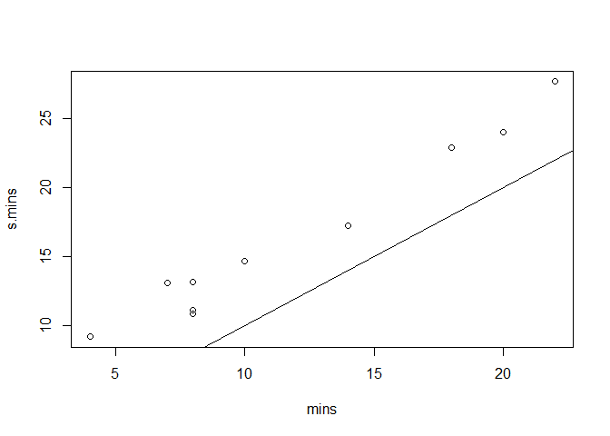
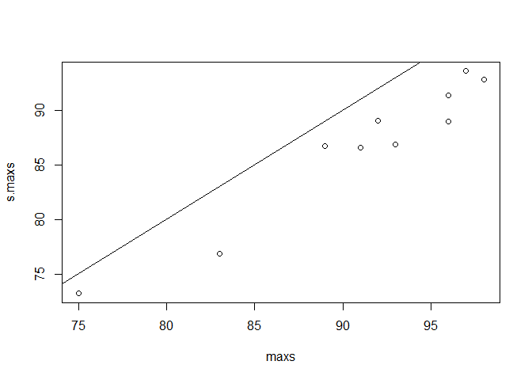
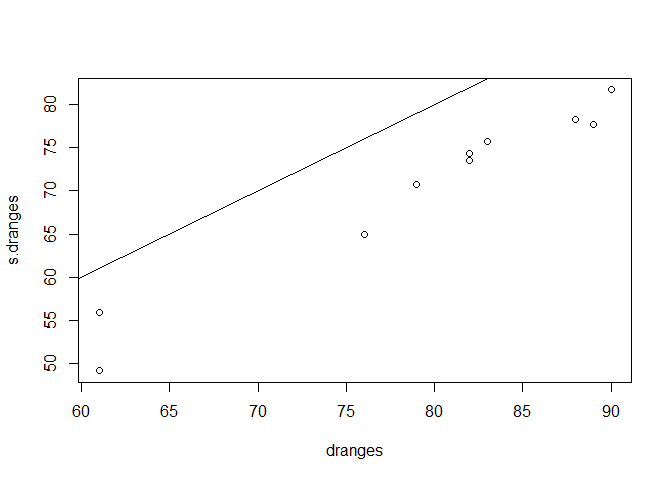

smoothf.cpp
================

## Smoothf.cpp

Smoothf.cpp implements some smooth, differentiable approximations to
max, min and range. Tests of these functions are implemented in R with
the Rcpp package. Comparisons between actual min, max, and max-min are
plotted.

``` r
library(Rcpp)
sourceCpp("smoothf.cpp")

S_alpha(c(1,2,3,100),-10)#min
```

    ## [1] 1.935251

``` r
S_alpha(c(1,2,3,100),0)#mean
```

    ## [1] 26.5

``` r
S_alpha(c(1,2,3,100),10)#max
```

    ## [1] 99.98366

``` r
LogSumExp(c(1,2,3,100),-10)#min
```

    ## [1] -12.50384

``` r
LogSumExp(c(1,2,3,100),10)#max
```

    ## [1] 100.0017

``` r
p_norm(c(1,2,3,100),100)#max abs
```

    ## [1] 100

``` r
p_norm(c(1,2,3,-7),10)#max abs
```

    ## [1] 7.000149

``` r
smooth_range(c(1,2,3,100),10)#range
```

    ## [1]  1.935251 99.983657

``` r
#actual
random_samples<-matrix(sample(100,100,replace=T),ncol=10)
mins<-apply(random_samples,2,min)
maxs<-apply(random_samples,2,max)
dranges<-apply(random_samples,2,function(x)diff(range(x)))
#smooth approximates
s.mins<-apply(random_samples,2,smooth_min)
s.maxs<-apply(random_samples,2,smooth_max)
s.dranges<-apply(random_samples,2,function(x)diff(smooth_range(x)))
plot(mins,s.mins)
abline(0,1)
```

<!-- -->

``` r
plot(maxs,s.maxs)
abline(0,1)
```

<!-- -->

``` r
plot(dranges,s.dranges)
abline(0,1)
```

<!-- -->

The plots are approximately linear with slope 1 although the intercept
does not appear to be zero as you’d want. This is because it
overestimates the minimum and underestimates the maximum.
